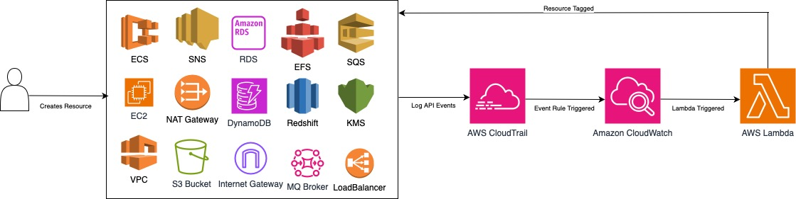

# AWS Auto-Tagging using Terraform and Lambda

This repository contains Terraform configurations and a Lambda function to implement automatic resource tagging in AWS.

## Overview

The Auto-Tagging setup uses AWS CloudTrail, AWS EventBridge, and a Lambda function to tag resources when they are created. The Lambda function is written in Python and uses the Boto3 library to interact with various AWS services.

## Prerequisites

Before you begin, make sure you have the following:

- [Terraform](https://www.terraform.io/) installed
- AWS credentials configured
- Python and [Boto3](https://boto3.amazonaws.com/v1/documentation/api/latest/index.html) for the Lambda function development

## Terraform Configurations

### Variables

- `aws_region`: AWS region for all resources (default: "ap-southeast-2").
- `create_trail`: Set to true to create a CloudTrail trail for management events (default: true).
- `autotag_function_name`: Name of the Lambda function (default: "autotag").

### Terraform Files

1. `providers.tf`: plugins and version definitions.
2. `variables.tf`: Input variable definitions.
3. `cloudtrail.tf`: CloudTrail configuration for capturing management events.
4. `eventbridge.tf`: EventBridge rules for triggering the Lambda function.
5. `iam.tf`: IAM roles and policies for Lambda function execution.
6. `lambda.tf`: Lambda function deployment and configuration.
7. `lambda_function.py`: Python script for the Lambda function.

## Lambda Function

The Lambda function (`lambda_function.py`) is responsible for tagging resources based on specific AWS events. The script includes logic for various resource types like SNS, S3, EC2, IAM, RDS, Lambda, CloudWatch Logs, and KMS.

Ensure that the necessary Python dependencies are installed before deploying the Lambda function.

## Deployment Steps

1. Clone this repository.
2. Update variables in `variables.tf` if necessary.
3. Run `terraform init` to initialize the Terraform configuration.
4. Run `terraform apply` to create AWS resources.
5. Monitor CloudWatch Logs for the Lambda function for any errors.

## Testing

1. Manually create resources that trigger Lambda function events (e.g., SNS topic, S3 bucket, EC2 instance).
2. Observe CloudWatch Logs for Lambda function output.

## Security Considerations

- Review IAM policies to ensure least privilege.
- Monitor CloudWatch Logs for security-related events.